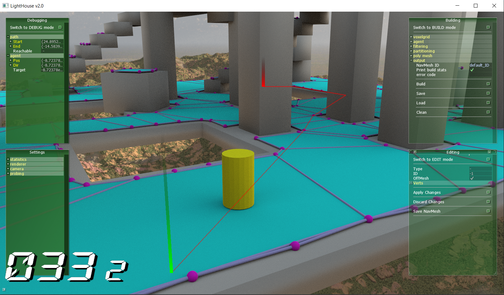

# AI Debugger
The AI Debugger app fascilitates the generation-, augmentation-, and debugging of navigation meshes using a graphical interface.

Dependencies:
* The pathfinding module, which requires the recastnavigation submodule
* Any render core that implements scene probing

## Usage

You can move the camera using WASD, and rotate using the arrow keys. Hold SHIFT to move faster.

#### Building

Navmeshes can be generated using the 'build' tab. The `NavMeshBuilder` class is automatically given the `HostScene` of the renderer, which is initialized in `main.cpp/PrepareScene()`. Navmesh generation is influenced by multiple configurations, the implications of which are more thoroughly explained in the [Pathfinding documentation](../../lib/PathFinding/README.md). Some parameters you see here are automatically rasterized to voxels before being passed to the builder. The following parameters can be found in the build menu:

* `AABB min/max`: The bounding box limiting the navmesh. Defaults to the scene bounds when 0.
* `cell size`: The width and depth of the voxel cells during rasterization.
* `cell height`: The height of the voxel cells during rasterization.
* `max slope`: The maximum slope this agent can traverse.
* `min height`: The minimum height the agent needs to fit underneath obstacles (i.e. the agent's height).
* `max climb`: The maximum height the agent can climb (e.g. stairs).
* `min radius`: The minimum width/depth the agent needs to fit in between obstacles (i.e. the agent's width).
* `filtering`: Whether to filter for low hanging obstacles/ledge spans/low height spans.
* `partition type`: The method used for partitioning. The options are:
    * Watershed partitioning
    * Monotone partitioning
    * Layer partitioning
* `min region area`: The minimum area that can constitue surface. Isolated surfaces smaller than this will be discarded.
* `merge region area`: The area needed to stay a separate region. When smaller than this, the region will (if possible) be merged with a neighboring region.
* `max edge length`: The maximum length any navmesh edge can have.
* `max simpl err`: The maximum distance a border edge can deviate from the generated contours.
* `max verts per poly`: The maximum number of vertices in a polygon, ranging from 3 to 6.
* `detail sample dist`: The sampling distance used to create the detail mesh.
* `detail max err`: The maximum distance the detail mesh surface can deviate from the heightfield.
* `NavMesh ID`: A string that identifies this navmesh. When saving, the file name will include this ID, and when loading, the app looks for the file with this ID.
* `Print build stats`: Whether to print detailed build statistics.
* `error code`(read only): If any errors occur, this will display "ERROR". Consult the terminal for further information.

Navmeshes can be built, saved, loaded, and cleared with the buttons underneath these options. Please note that, currently, only the navmesh itself is saved. Loading a navmesh does not recover the intermediate build results required to edit it.

#### Editing

To edit a navmesh, first generate one using the build menu and activate `EDIT` mode using the uppermost button on the edit menu. To select a polygon, edge, or vertex, hold SHIFT and left click the object. The edit menu now displays the details of the object. *(Editing hasn't been implemented yet)*.

To add an off mesh connection, hold CTRL and left click to set the starting point, then right click to set the end. Once both points have been set, the OMC is added to the builder. You can hit 'Apply Changes'and switch to the debug menu to test it, and then switch back to the edit or build menu to save it.

#### Debugging

To test the navmesh, activate the debug menu using the uppermost button. Paths can be drawn by holding CTRL. Left click to set the start, right click to set the end.

To add an agent, hold SHIFT while right clicking anywhere on the navmesh. Hold SHIFT and left click to select an agent. When an agent is selected, hold CTRL and right click to give it a target. The debug menu displays all relevant details on the agent and its path.

 
 

## Backlog

* clean up main_ui.h ❗

#### Building
* extensive QA testing for all build params
* give instances/meshes a flag that can exclude them from navmesh generation

#### Editing
* navmesh editing
    * finish AntTweakBar vert hiding ❗
    * spawn unit axis at selected vert/edge
    * add mouse controls to drag unit axis
    * make local copy of changed objects
        * Make NavMeshShader verts reference this local copy
        * apply changes in AntTweakBar 'Apply Changes' callback
        * discard changes in AntTweakBar 'Discard Changes' callback
* off-mesh connections
    * make OMCs visible and editable in the edit menu (radius, directionality)
* edit menu
    * add polygon flags/areas ❗

#### Debugging
* BUG: agent pos/dir/target can't be tracked bc the pointer keeps changing
* add agent editing (dtQueryFilter, speed)

#### UI
* add mouse movement
    * middle mouse draggin for up/down
    * right mouse dragging for rotation (except when CTRL SHIFT)
* typing w/a/s/d in navmesh ID field moves camera
* automatic conversion tab in build menu
    * agent height/radius/climb in world coordinates
    * conversion to voxels before building
* add pause button to disable agents/physics updates
* don't refresh navmesh when nothing has been edited
* OpenGL highlights lag behind 1 frame due to scene probing delay